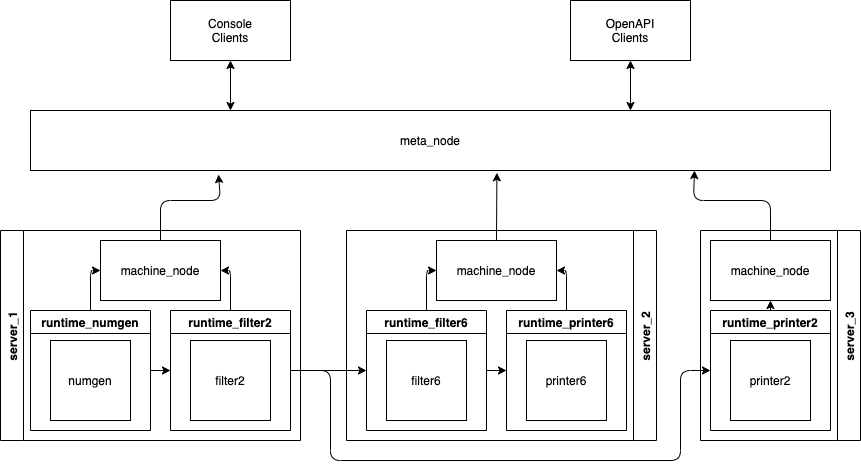

## Общее описание

GoStreaming является распределенной системой обработки потоков данных. Позволяет связывать узлы графа обработки данных, которые могут находится на разных серверах, при этом обеспечивает гарантию доставки сообщений от источника до стока.

### Обзор

Граф потока данных представляет собой набор узлов, каждый из которых выполняет некоторое атомарное действие, связанных между собой ребрами, которые задают направление передвижения данных. Далее представлено описание каждого из компонентов.

### Действия

Действие в системе представляет собой произвольный бинарный файл, который обменивается данным с «внешним миром» при помощи [стандартных потоков](https://www.gnu.org/software/libc/manual/html_node/Standard-Streams.html).

Действия создает пользователь, реализуя необходимую бизнес-логику. Подробнее о создании и работе действий [тут](./runtime.md).

### Связи

Действия связаны между собой ребрами, которые задают движение данных. При этом GoStreaming обеспечивает гарантию доставки данных at-least-once.

### Граф потока данных

Описание графа потока данных задается в виде алгебраического выражения. Элементами выражения являются уникальные имена действий, а связи задаются операторами:

* `;` — задает последовательное выполнение действий.
* `||` — задает параллельное выполнение действий, при этом входящий поток копируется на вход всем действиям.

Приоритет данных операторов одинаков, возможно использовать скобки. Подробнее о описание схемы работы и графа обработки данных [тут](./client.md).

### Компоненты

Описание компонентов системы GoStreaming:

* meta_node: находится на верхнем уровне иерархии, обеспечивает поддержание API для пользователя, а также контроль за графом обработки данных.  [Подробнее](./meta_node.md).
* machine_node: запускается в единственном экземпляре на каждом сервере, служит для запуска/контроля/отключения действий на конкретном сервере. [Подробнее](./machine_node.md).
* runtime: обертка над действием, занимается непосредственно передачей данных, обеспечением доставки данных и отслеживанием состояния действия. [Подробнее](./runtime.md).
* gostreaming: консольный клиент для работы с meta_node, непосредственно используется пользователем. [Подробнее](./client.md).

